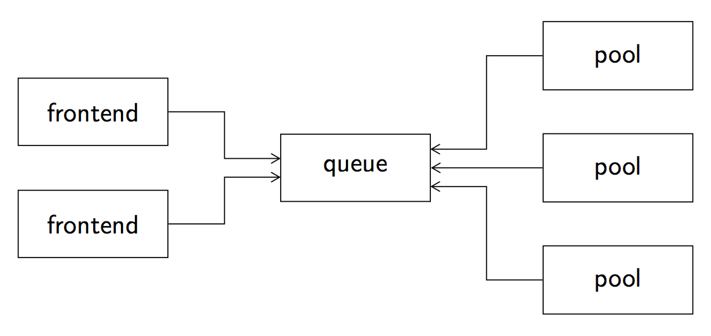
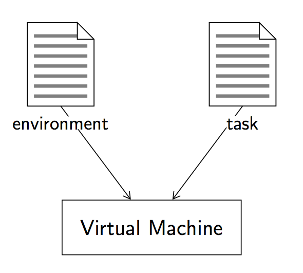

Presentation
============

The pythia-core framework makes it possible to execute code in a safe environment. It can be used to grade codes written written by non-trusted people, such as students in a learning environment, for example. The framework can execute jobs provided with optional inputs and that will produce outputs upon completion.

Queue and pools
---------------

The pythia-core framework is built on two mains components, namely one queue and several pools. As shown on Figure 1, the `queue` is the entry point of the framework which receives the jobs to be executed from the outside. It then dispatches the jobs to pools (of execution) and waits for the result to send it back to the job's submitter. A `pool` launches a new virtual machine for each job it is asked to execute, so that to execute it in a safe and controlled environment.

   Figure 1: The pythia-core framework is composed of two main components, namely a queue and several pools.

The queue is the main component and is waiting for incoming connections. It means that the other components, that is, the pools and the frontends, have to first connect to the queue before being able to offer their services.

Environment and task filesystems
--------------------------------

`Jobs` that are executed by the virtual machines launched by the pools. They are composed of several elements as shown on Figure 2. The `environment` filesystem contains all the files that are necessary to execute the job (compilers, interpretors, configuration files, etc.) The `task` filesystem contains all the files that are specific to the job. In particular, it contains a `control` file which is launched at the job startup.

   
   Figure 2: A job is composed of an environment and a task files.

Several predefined environments are available in the `environments repository
<https://github.com/pythia-project/environments>`_ on the GitHub page of the Pythia project organisation.

Task description
----------------

In addition to the environment and task filesystems, the virtual machine can be configured with a set of constraints. The configuration is stored in a `.task` file containing a JSON object. The following table lists the parameters that can be configured:

.. table::

   +-----------------+-----------------+---------------------------------------------------+
   | Key             | Subkey          | Description                                       |
   +=================+=================+===================================================+
   | ``environment`` |                 | Environment to use to execute the job             |
   +-----------------+-----------------+---------------------------------------------------+
   | ``taskfs``      |                 | Path to the task filesystem                       |
   +-----------------+-----------------+---------------------------------------------------+
   | ``limits``      | ``time``        | Maximum execution time allowed (seconds)          |
   +-----------------+-----------------+---------------------------------------------------+
   |                 | ``memory``      | Maximum amount on main memory (Mo)                |
   +-----------------+-----------------+---------------------------------------------------+
   |                 | ``disk``        | Size of the disk memory (percentage)              |
   +-----------------+-----------------+---------------------------------------------------+
   |                 | ``output``      | Maximum size of the output (number of characters) |
   +-----------------+-----------------+---------------------------------------------------+

Hello World example
-------------------

Let us examine a simple example of a job whose execution simply returns `Hello World!`. The first thing to do is to define the task filesystem. The first file, namely ``hello.sh``, is just a shell script that prints ``Hello World!`` on the standard output.

.. code-block:: shell

   #!/bin/sh
   echo "Hello world!"

The second file, namely ``control``, must contain the sequence of executables to launch. It is the only file that is mandatory in a task filesystem. The one of this example just calls the ``hello.sh`` script. Note that the task filesystem is mounted in the ``/task`` directory inside the virtual machine.

.. code-block:: none

   /task/hello.sh

Finally, constraints related to the execution environment of the job are specified in the ``hello-world.task`` file. The job uses the ``busybox`` environment (which provides several stripped-down Unix tools including ``sh``) and the task filesystem is contained in the ``hello-world.sfs`` file. The execution time is limited to 60 seconds, the main memory to 32 Mo, the disk size to 50% and the lenght of the output to 1024 characters.

.. code-block:: json

   {
     "environment": "busybox",
     "taskfs": "hello-world.sfs",
     "limits": {
       "time": 60,
       "memory": 32,
       "disk": 50,
       "output": 1024
     }
   }